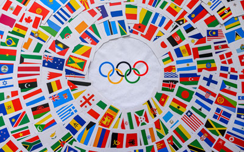

```{css, echo = FALSE}
.columns {display:flex;}
h1.title {font-size: 40 px;color: #CD1076}
h1 {color:#CD1076; font-size: 30px ;font-family: Arial Black}
h2{color: #CD1076; font-size: 20px; font-family: Arial}
body { background-color: #EEDFCC}
a {color: #CD1076;}
.list-group-item.active, .list-group-item.active:focus, .list-group-item.active:hover {
    z-index: 2;
    color: ;
    background-color: #CD1076;
    border-color: palered;
}
.nav-pills > li.active > a, .nav-pills > li.active > a:hover, .nav-pills > li.active > 
```


```{r packages-setup, include = FALSE}
library(tidyverse)
library(klippy)   
remotes::install_github("rlesur/klippy")
'force = TRUE'
library(knitr)
```

```{r chunk-setup, include = FALSE}
knitr::opts_chunk$set(echo = TRUE, eval = TRUE, message = FALSE, warning = FALSE, 
                      #results = "hold",
                      cache = FALSE, cache.path = "/caches/", comment = "#>",
                      #fig.width = 7, #fig.height= 7,   
                      #out.width = 7, out.height = 7,
                      collapse = TRUE,  fig.show = "hold",
                      fig.asp = 0.628, out.width = "75%", fig.align = "center")
knitr::opts_chunk$set(dev = "png", dev.args = list(type = "cairo-png"))
```


```{r options-setup, include = FALSE}
options(scipen = 999) #- para quitar la notación científica
options("yaml.eval.expr" = TRUE) 
```


```{r klippy, echo = FALSE}
klippy::klippy(position = c("top", "right")) #- remotes::install_github("rlesur/klippy")
```


<hr class="linea-black">

<!-- El párrafo de abajo has de dejarlo casi igual, solo HAS de SUSTITUIR "perezp44" por tu usuario de Github-->
Trabajo elaborado para la asignatura "Programación y manejo de datos en la era del Big Data" de la Universitat de València durante el curso 2021-2022. El repo del trabajo está [aquí](https://github.com/albaibanyez8/trabajo_BigData){target="_blank"}. 

<!-- El párrafo de abajo has de dejarlo exactamente igual, NO HAS DE CAMBIAR NADA-->

La página web de la asignatura y los trabajos de mis compañeros pueden verse [aquí](https://perezp44.github.io/intro-ds-21-22-web/07-trabajos.html){target="_blank"}.


<hr class="linea-red">

# [1. Introducción]{.verdecito}

El objetivo principal de este trabajo sería un análisis de los **Juegos Olímipicos** en la historia a través de diferentes variables: género, disciplinas, medallas... 
Se pondrá en práctica muchos de los conocimientos adquiridos en las clases de 'Programación y manejo de datos en la era de Big Data' con sus respectivas y más importantes funciones, gráficos y demás que hemos asimilado durante el curso.


Los **Juegos Olímpicos** son el mayor evento deportivo internacional multidisciplinario en el que participan atletas de diversas partes del mundo. Los Juegos Olímpicos son considerados la principal competición del mundo deportivo, con más de doscientas naciones participantes. Existen dos tipos: los Juegos Olímpicos de Verano y los Juegos Olímpicos de Invierno, que se realizan con un intervalo de dos años, según la Carta Olímpica: «Los Juegos de la Olimpiada se celebran durante el primer año de una Olimpiada y los Juegos Olímpicos de Invierno durante su tercer año.
En nuestro trabajo, algunos de los análisis tratarab sobre los Juegos Olímpicos de Verano y otros de los Juegos Olímpicos en general.

 

# 2. Datos

Los datos para realizar el análisis oportuno han sido extraidos de **Kaggle** ya que dicha plataforma contenía unna gran variedad de datos relacionados con esta gran competición.


## 2.1. Procesando los datos
El análisis se ha realizado sobre 4 dataframes:

 **aa**: 31165 observaciones.
 
 **bb**:11085 observaciones.
 
 **cc**:46 observaciones.
 
 **dd**:93 observaciones.


```{r, include = FALSE, echo=FALSE, warning=FALSE}
knitr::opts_chunk$set(echo = TRUE)

datos1 <- here::here("datos", "summer.csv")

aa <- rio::import(datos1) 

datos2 <- here::here("datos", "Athletes.xlsx")

bb <- rio::import(datos2) 

datos3 <- here::here("datos", "EntriesGender.xlsx")

cc <- rio::import(datos3)

datos4 <- here::here("datos", "Medals.xlsx")

dd <- rio::import(datos4) 
```

```{r, echo = TRUE, eval = TRUE, warning=FALSE}
library(ggplot2) 
library(readr) 
library(plyr)
library(rworldmap)
library(repr)
library(plotly)

```


# 3. Participación según Género.

Como se puede observar en el gráfico, la participación de Hombres y mujeres desde 1896 hasta 2012 no ha estado equilibrada. Mediante un gráfico de lineas, se visualiza que año a año, el número de hombres que han participado medidio por la variable freq ha sido bastante superior al de mujeres sobretodo en el pico del año 1920 donde la participación de las mujeres (43) en el juego estaba muy por debajo de la del género masculino (1255). Se ha animado el ggplot para ver mejor el resultado.


```{r, echo = TRUE, eval = TRUE, warning=FALSE}
df_aa <- aa %>%
select(Year, Gender)%>%
group_by(Gender,Year)%>%
count()
ggplot_aa <- ggplot() + geom_line(data = df_aa, aes(x= Year, y=freq, group = Gender, color = Gender)) +
labs(title = 'Participación año a año (género)',
     color = "Género")  + xlab("Año") + ylab("Nº de Hombres y Mujeres") + theme_void()

ggplotly(ggplot_aa)

```

# 4.  Diez países con más medallas.

Este gráfico muestra muy visualmente 10 puntos que corresponden a los 10 países que han ganado más medallas en los Juegos Olímipicos.Se ha restringido a 10 para que quedara más visual con la función head.Además se han combinado los colores del gráfico con la opción theme para que se viera claramente. Podemos encontrar países como Australia, Francia, Alemania, Japón,ROC... y claramente, si pinchamos en el punto más alto , el país que destaca es People's Republic of China con un totoal de 88 medallas.

```{r, echo = TRUE, eval = TRUE, warning=FALSE}
df_dd <- dd %>%
  head(10)
  
ggplotc <- ggplot(df_dd, aes(Pais, Total, size = 0.75, color= "orange")) +
  geom_point() +
  theme_bw()+ 
  theme(legend.position = "none") +
  labs(x = NULL) + theme(axis.title.x=element_blank(),
        axis.text.x=element_blank(),
        axis.ticks.x=element_blank()) + labs(title= "Los 10 países con más Medallas") +
  theme(panel.background = element_rect(fill = 'wheat1', colour = 'red')) + theme(panel.background = element_rect(fill = "White"),
    plot.background = element_rect(fill = "#EEDFCC",
        colour = "#EEDFCC"))

ggplotly(ggplotc)

df_dd

```


 


## 4. 1. Medallas en los diferentes países.

Como podemos ver, los países con más medallas en los Juegos Olímpicos son los países desarrollados de América del Norte, Asia y Europa. Los países más pobres de África y América del Sur no destacan por ello.

Este mapa ha sido realizado de forma más costosa con lo aprendido en clase y la información proporcionada en un kaggle sobre el tema a analizar.

```{r, echo = TRUE, eval = TRUE, warning=FALSE}
count=c(1)
aa$MedalCount=count
aa$Athlete=as.character(aa$Athlete)

options(repr.plot.width=6, repr.plot.height=6)
world <- map_data(map="world")
world <- world[world$region != "Antarctica",] # 
y=ddply(aa, .(Country,Medal), numcolwise(sum))
sPDF <- joinCountryData2Map( y
                             ,joinCode = "ISO3"
                             ,nameJoinColumn = "Country")

mapCountryData(sPDF
               ,nameColumnToPlot='MedalCount')

```

# 5. Tipo Medallas en los países más importantes.

En este apartado se analiza el tipo de medallas que se han ganado en cinco países diferentes. Se han filtrado los países y agrupado según el país y el tipo de medalla. Como se observa en el gráfico, el país con más medallas de oro representado en color verde se identifica con USA seguido por Rusia. El que menos medallas de oro ha ganado es Alemania. USA también destaca por su número de medallas de plata y de bronze. Es generalmente el país que más destaca en el análisis.

```{r, echo = TRUE, eval = TRUE, warning=FALSE}
df_bb <- aa %>%
select(Country, Medal, MedalCount, Year)%>%
group_by(Country, MedalCount)%>%
filter(Country %in% c("GER", "FRA", "GBR", "URS", "USA") )


ggplota <- ggplot(df_bb,aes(x=reorder(Country,MedalCount),y=MedalCount,fill=Medal,group=Medal))+geom_bar(stat='identity')


ggplota
```

 

# 6. Número de atletas que participan en cada país.

Mediante un gráfico de barras invertido con coord flip para mejorar la visualización , podemos observar que USA cuenta con el mayor número de atletas que participan en las Olimpiadas seguido de Japón. Nuestro país se queda por debajo de estos.Este gráfico también es interactivo.

```{r, echo = TRUE, eval = TRUE, warning=FALSE}

atletas_mundo <- bb%>%
    group_by(NOC) %>%
        summarise(count = n()) %>%
        arrange(desc(count))%>%
        head(10)

atletas_mundo

ggplotb <-ggplot(atletas_mundo, aes(x = NOC, y = count)) + 
      geom_col(aes(fill = NOC), color = "black")  + theme(legend.position = 'none')+ coord_flip() + xlab("Atletas") + ylab("Países")
 
ggplotly(ggplotb)


```

# 7. Número de deportistas que se presentan a las disciplinas más

Mediante este gráfico circular, se observa la disciplina más practicada en los juegos olímpicos. Se trata de gimnasia y voley playa. Una de las que menos es basket. Hemos restringido el análisis a 10 disciplinas.Con theme he modificado la estética del gráfico para que con el color se vea mejor.

```{r, echo = TRUE, eval = TRUE, warning=FALSE}

df_cc <- cc %>%
arrange(desc(Total))%>%
slice_max(Total, n=10)


df_cca <- ggplot(df_cc, aes(x=reorder(Discipline, Total), y=Total, fill=Discipline))+
  geom_bar(stat="identity") +
  theme(legend.position = "none") +
  coord_polar(start = 0.01) +
  labs (x="Disciplinas") + labs(y="Total personas practican") + labs(title = "Num. Personas que practican cada disciplina") + theme(panel.background = element_rect(fill = "#EEDFCC"),
    plot.background = element_rect(fill = "#EEDFCC"))

df_cc
df_cca
```


# 8. Trabajos en los que te has basado:

Principalmente me he basado en los tutoriales de lapágina web de trabajo de la asignatura y de Kaggle que seran notificados en la bibliografía del trabajo.


# 9. Conclusión.

> "Nadie llega tan lejos si no es para seguir"

En este trabajo he asentado lo que hemos aprendido en el curso de Programación y manejo de datos en la era de Big data. Sobretodo he enfatizado en la visualización de los diferentes ggplots. Este tema siempre me ha llamado la atención y se ha podido observar un breve análisis sobre las variables más significativas del tema. Puede servir de información útil para la gente aficionada en el tema.


# 11. Bibliografía

- [Página web de la asignatura.](https://perezp44.github.io/intro-ds-21-22-web/04-tutoriales.html)

- [Kaggle sobre Juegos Olímpicos](https://www.kaggle.com/arpitsolanki14/olympic-games-data-analysis)

- [Kaggle sobre Juegos Olímpicos](https://www.kaggle.com/alvarorodriguezg/olympic-games/data)

<br><br>

<hr class="linea-red">
<hr class="linea-red">

# 12. Sesión Informativa.

```{r, echo = FALSE}
sessioninfo::session_info() %>% details::details(summary = 'Información de mi R-sesión:') 
```


<br><br>

<div class="tocify-extend-page" data-unique="tocify-extend-page" style="height: 0;"></div>


